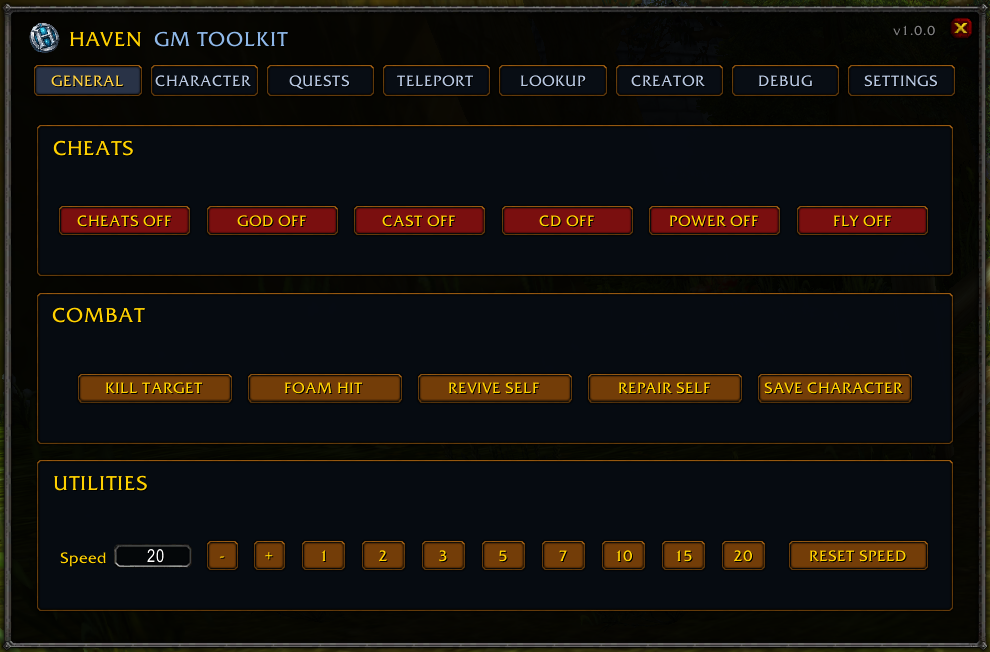
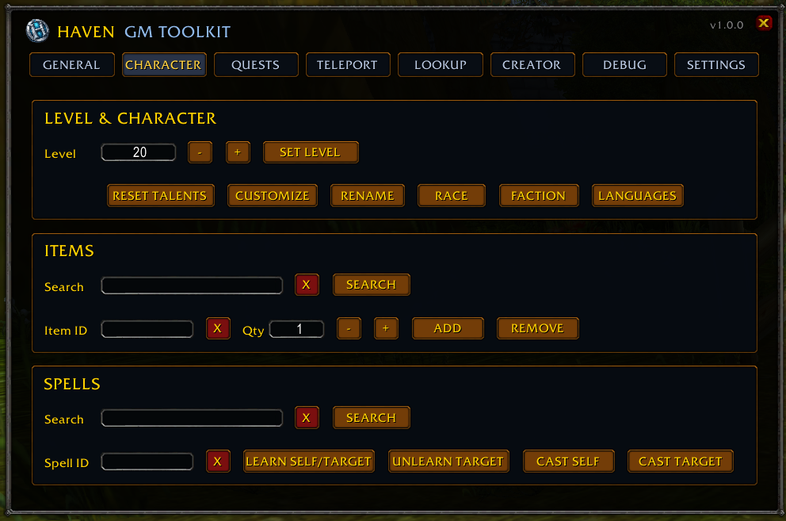
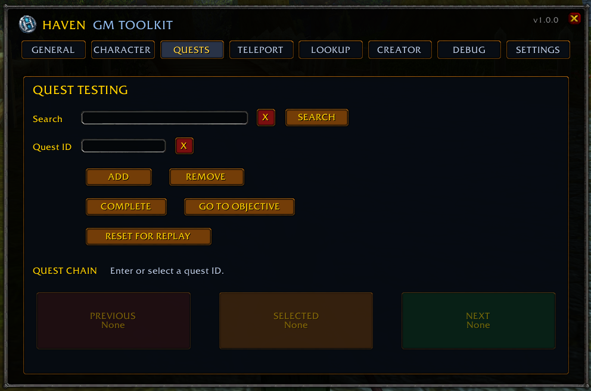
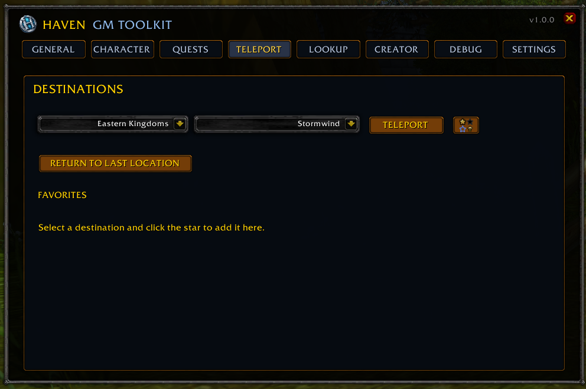
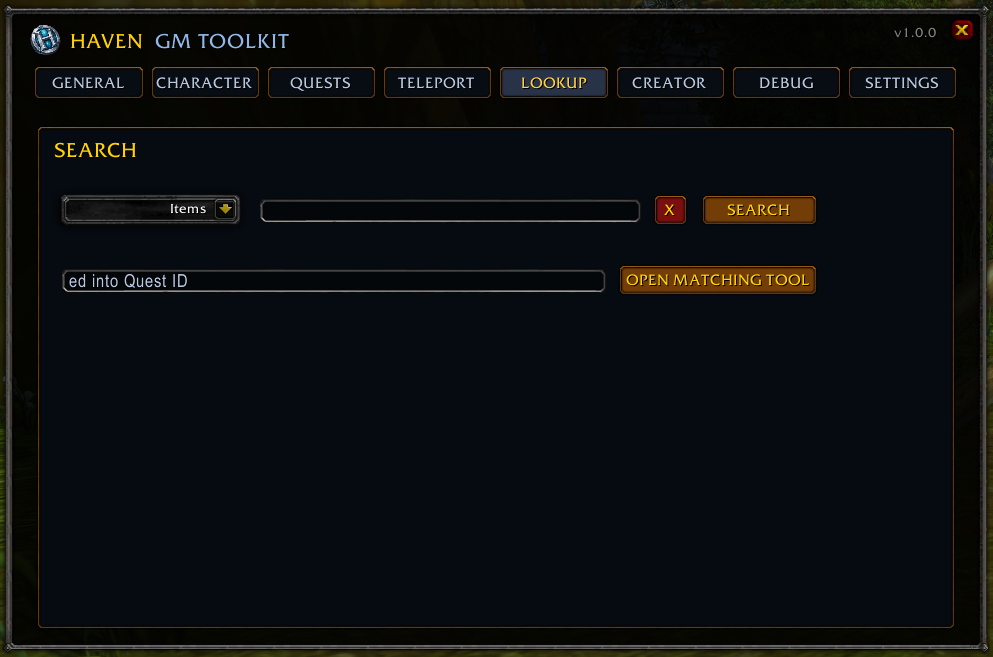
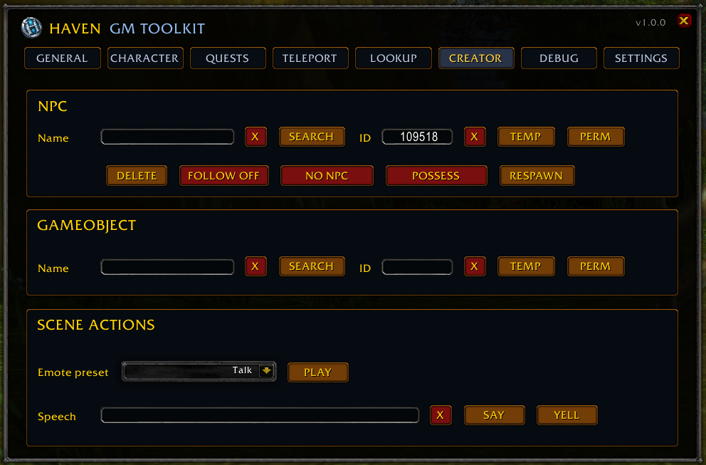
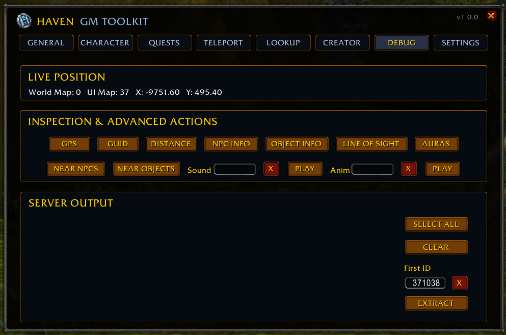
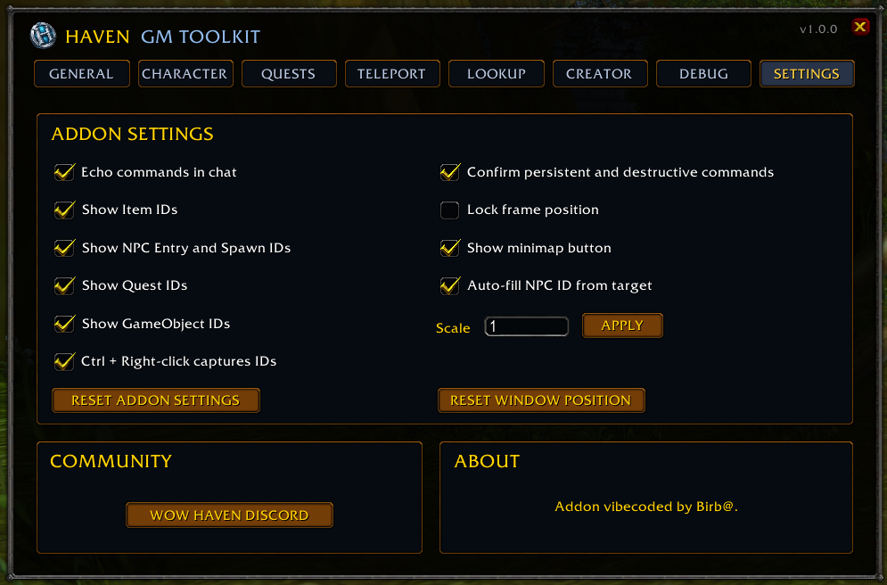

# Haven GM Toolkit

Haven GM Toolkit is a Game Master addon for HavenCore (Battle for Azeroth 8.3.7).

It provides quick access to common GM commands used during development, testing and content creation while keeping the executed server commands visible.

## Features

- Character management
- Quest testing
- Teleports and favorites
- Item, spell and creature lookup
- NPC and GameObject spawning
- Debug and inspection tools
- Server command output

## Installation

Copy the `HavenGM` folder to:

Interface/AddOns/

Restart the client or reload the UI.

## Screenshots

### General

### Character

### Quests

### Teleport

### Lookup

### Creator

### Debug

### Settings

